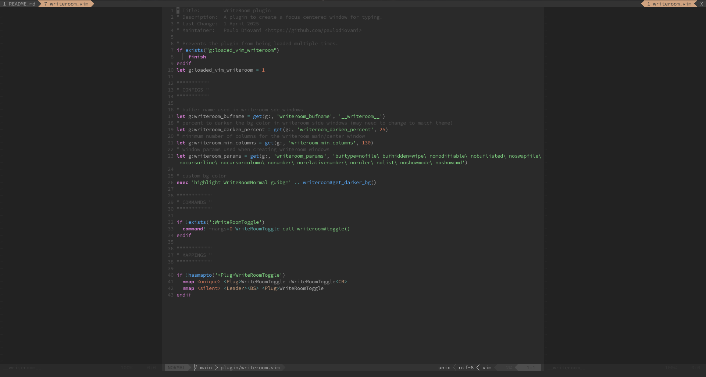

# vim-writeroom

A Vim plugin that creates a focused centered window for typing.



## Features

- Written in pure vim script
- Toggle a centered writing area with darkened side panels
- Customizable width for the writing area
- Automatically darkens the side panels based on your current colorscheme
- Simple keybinding to toggle the WriteRoom mode

## Installation

### Using a plugin manager (recommended)

#### [vim-plug](https://github.com/junegunn/vim-plug)

```vim
Plug 'paulodiovani/vim-writeroom'
```

#### [Vundle](https://github.com/VundleVim/Vundle.vim)

```vim
Plugin 'paulodiovani/vim-writeroom'
```

#### [packer.nvim](https://github.com/wbthomason/packer.nvim)

```lua
use 'paulodiovani/vim-writeroom'
```

### Manual installation

Clone this repository into your Vim plugins directory:

```bash
# For Vim
git clone https://github.com/paulodiovani/vim-writeroom.git ~/.vim/pack/plugins/start/vim-writeroom

# For Neovim
git clone https://github.com/paulodiovani/vim-writeroom.git ~/.local/share/nvim/site/pack/plugins/start/vim-writeroom
```

## Usage

Toggle WriteRoom mode with:
- `<Leader><BS>` (default mapping)
- `:WriteRoomToggle` command

## Configuration

Add the following settings to your `.vimrc` or `init.vim` to customize the plugin's behavior.
Default values are shown below.

```vim
" Buffer name used in WriteRoom side windows
let g:writeroom_bufname = '__writeroom__'

" Percent to darken the background color in side windows (0-100)
let g:writeroom_darken_percent = 25

" Minimum number of columns for the main/center window
let g:writeroom_min_columns = 130

" Window parameters for side panels
let g:writeroom_params = 'buftype=nofile bufhidden=wipe nomodifiable nobuflisted noswapfile nocursorline nocursorcolumn nonumber norelativenumber noruler nolist noshowmode noshowcmd'
```
