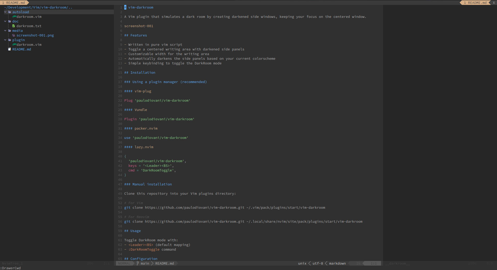

# vim-darkroom

A Vim plugin that simulates a dark room by creating darkened side windows, keeping your focus on the centered window.



## Features

- Written in pure vim script
- Toggle a centered writing area with darkened side panels
- Automatically darkens the side panels based on your current colorscheme
- Run Vim commands in side windows (file explorer, terminal, etc.)

## Installation

### Using a plugin manager (recommended)

#### [vim-plug](https://github.com/junegunn/vim-plug)

```vim
Plug 'paulodiovani/vim-darkroom'
```

#### [Vundle](https://github.com/VundleVim/Vundle.vim)

```vim
Plugin 'paulodiovani/vim-darkroom'
```

#### [packer.nvim](https://github.com/wbthomason/packer.nvim)

```lua
use 'paulodiovani/vim-darkroom'
```

#### [lazy.nvim](https://github.com/folke/lazy.nvim)

```lua
{
  'paulodiovani/vim-darkroom',
  keys = '<Leader><BS>',
  cmd = 'DarkRoomToggle',
}
```

### Manual installation

Clone this repository into your Vim plugins directory:

```bash
# For Vim
git clone https://github.com/paulodiovani/vim-darkroom.git ~/.vim/pack/plugins/start/vim-darkroom

# For Neovim
git clone https://github.com/paulodiovani/vim-darkroom.git ~/.local/share/nvim/site/pack/plugins/start/vim-darkroom
```

## Usage

Toggle DarkRoom mode with:
- `<Leader><BS>` (default mapping)
- `:DarkRoomToggle` command

Execute commands in side panels:
- `:DarkRoomLeft {cmd}` - Run command in left panel
- `:DarkRoomRight {cmd}` - Run command in right panel
- `:DarkRoomReplaceLeft {cmd}` - Replace left darkroom window with a Vim command
- `:DarkRoomReplaceRight {cmd}` - Replace right darkroom window with a Vim command

Examples:
```vim
" Show file explorer in left panel
:DarkRoomLeft Explore

" Show help in right panel
:DarkRoomRight help darkroom

" Replace left panel with terminal
:DarkRoomReplaceLeft terminal
```

## Configuration

Add the following settings to your `.vimrc` or `init.vim` to customize the plugin's behavior.
Default values are shown below.

```vim
" Buffer name used in DarkRoom side windows
let g:darkroom_bufname = '__darkroom__'

" Highlight group name for darkroom windows
let g:darkroom_highlight = 'DarkRoomNormal'

" Percent to darken the background color in side windows (0-100)
let g:darkroom_darken_percent = 25

" Minimum number of columns for the main/center window
let g:darkroom_min_columns = 130

" Window parameters for side panels
let g:darkroom_params = 'buftype=nofile bufhidden=wipe nomodifiable nobuflisted noswapfile nocursorline nocursorcolumn nonumber norelativenumber noruler nolist noshowmode noshowcmd'
```
